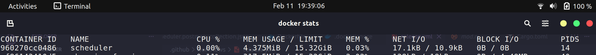

# Scheduler API

API untuk sistem scheduler dengan fitur autentikasi JWT dan manajemen user, 
Kunjungi [**Postman**](https://www.postman.com/teknohole/workspace/teknohole-api-documentations/collection/42950376-ab6e86b9-f96e-4a7c-92ff-8a454299bf6a?action=share&source=copy-link&creator=42950376) untuk dokumentasi API lengkap.

> Write on rust for efficiency and better peformance
## Ringan dan Hemat memori kurang dari 5 MB

Tersedia versi container: [teknohole/scheduler:latest](https://hub.docker.com/r/teknohole/scheduler)

Rilis binary terbaru (linux/windows): [github.com/Arbath/scheduler](https://github.com/Arbath/scheduler)

>by: arbath@teknohole.com